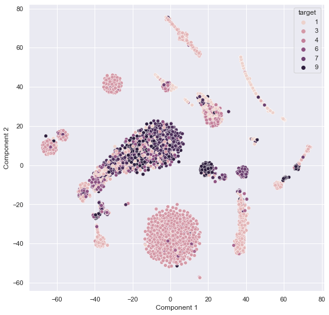
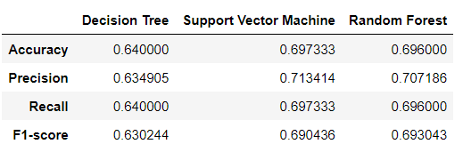
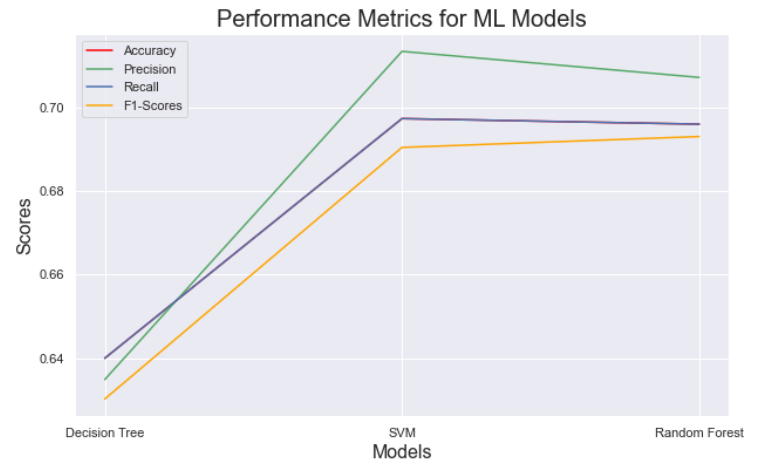

This repository consists of the Python Code used for classifying different Malware attacks on a fictional server based on the attack instance data collected over the years.

# Project Prompt

Your IT department has been struggling with an onslaught of malware of different types for the past several months, painstakingly grouped into a few types. Now, one of their data centers has gone down, and they believe it's due to the same malware. But it takes weeks to sort out what kind they've been hit with. The CIO heard that you took DATA 602 and asked for your help. You've been given a dataset of the features the CERT has developed so far, and the associated malware family IDs. 

The CIO has the following goals for you:
1. Can you develop a classifier based on this data, and will it be able to give us an accurate estimate of which malware family has just taken down our data center? 
2. What can you tell the CIO about what has already been found and processed by the CERT? All of the feature creation and labeling is expensive! 

Like many real-world projects, you've been thrown into this with no documentation, and no information about the data or its quality. You've met two people from the CERT doing this work. One was pretty sharp, and the other seemed like their dad must have gotten them the job... worse, the person who developed the features quit last week. 

## Introduction

The CERT team has collected 4999 instances of malware attacks in the company and managed to classify them into 9 classes of malware.

From their initial analysis, malware type 3 has the maximum recurrences. It constitutes almost 27% of the attacks.

The dataset provided by the CERT is extremely complex and huge. It has 1805 features including the malware class named 'target'. We have to implement a lot of preprocessing to get a satisfactory model for malware detection.

## Malware Classification

## Summary of Findings and Performance of Models

- The malware <b>class 3</b> is the most identified class from the given data set. Even the models tend to predict the same, however, not with much accuracy. 

- The Support vector machine has the best performance among the three deployed models.

- 

- 

- 12 features show a high correlation (greater than 0.8) and 64 of them correlate greater than 0.6

- |              |    Train Accuracy   |  Test Accuracy  |
  |--------------|---------------------|-----------------|
  |Decision Tree |        73.1%        |      64.0%      |
  |SVM           |        70.8%        |      69.7%      |
  |Random Forest |        94.3%        |      69.6%      |
  
  We can observe that the random forest classifier has a very high accuracy on the train data set which indicates the overfitting of the model. The lower accuracy on the test data set is due to this overfitting.

## Challenges faced

- Dealing with big data is challenging, especially an organized one with no metadata available for understanding the data better.

- The feature 'target' was assumed to be the malware classification for the entire data analysis and machine learning.

- The lack of metadata would have resulted in the omission of necessary features which appeared to be outliers in the data set.

- The high standard deviation of the features along with the high difference in the range of data(max-min) affected the outlier detection using the interquartile range. 
 
- The time constraint restricted further tuning and analyzing of the data. Data cleaning and preprocessing consumed a major share of the stipulated time, therefore, modeling is incomplete.
 
- The lack of fine-tuning of hyperparameters of the models has resulted in overfitting especially in random forest classifiers. 
 
- Computation also was time-consuming due to the size of the data. Many times it had to be cut short into a few features, especially visualization.

## Strengths and Weaknesses of the methods deployed

- Decision Tree Classifier: The direct if-else implementation of complex and bulky data does not provide accurate results. A grid search cross-validation on the dataset might have helped improve the accuracy of the model by a few decimal points.
- Support Vector Machine: The high accuracy of SVM lies in its robustness with high-dimensional data and compatibility with imbalanced data. However, the lack of fine-tuning hyperparameter tuning has resulted in a lower-than-potential accuracy of the model.
- Random Forest Classifiers: Like SVM, Random forests also exhibit good performance with high-dimensional and imbalanced data. The random forest will perform better with t-SNE dimensionality reduction than the used PCA.

## Potential Improvements and Future Work

- ### Improvements:
 - <b>Fine Hyperparameter Tuning:</b> The machine learning models require finer tuning of their hyperparameters. This requires better computational resources and more time. SVM and Random forest will show significant improvement with fine-tuning. However, due to the complexity of the data and high dimensionality, decision trees would not show much change
 - <b>Data Cleaning:</b> Even though this step was tedious and time-consuming, it was not enough. Proper cleaning based on more domain knowledge and metadata study will improve the quality of the cleaned dataset. There is a good possibility that a few important features were discarded due to a lack of data knowledge.
 - <b>Data Preprocessing:</b> In this model preparation, PCA was used to reduce the dimensionality of the data. However, other methods and tuning of PCA components can give better-quality of data for modeling.
 - <b>Data Visualization:</b> Due to a large number of features, the data visualization was not properly done. Finding the significant features with proper Data cleaning and preprocessing is required for meaningful visualizations.
 - <b>Machine Learning Models:</b> There are more complex machine learning models that could provide better accuracy in the predictions. Even with the current deployed ones, better tuning and preprocessing could improve the prediction accuracy.

- ### Future Work:
 - <b>Malware Tracing:</b> The ML models can be deployed in tracing future malware attacks and understanding the class so that the actions can be taken immediately before the attack is irreversible.
 - <b>Malware Protection:</b> The analysis from this project can be further extended to detect malware even before they are implemented on a system. It can be developed into an anti-virus software. The different features in the data set can be closely observed to identify any malware sources.

